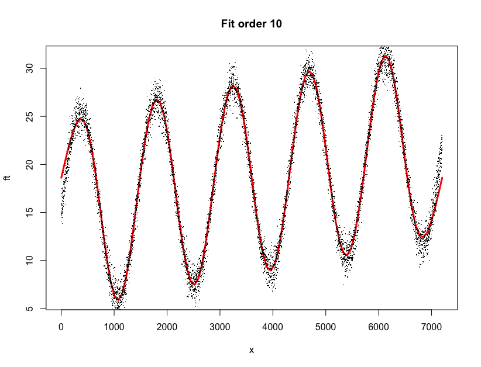
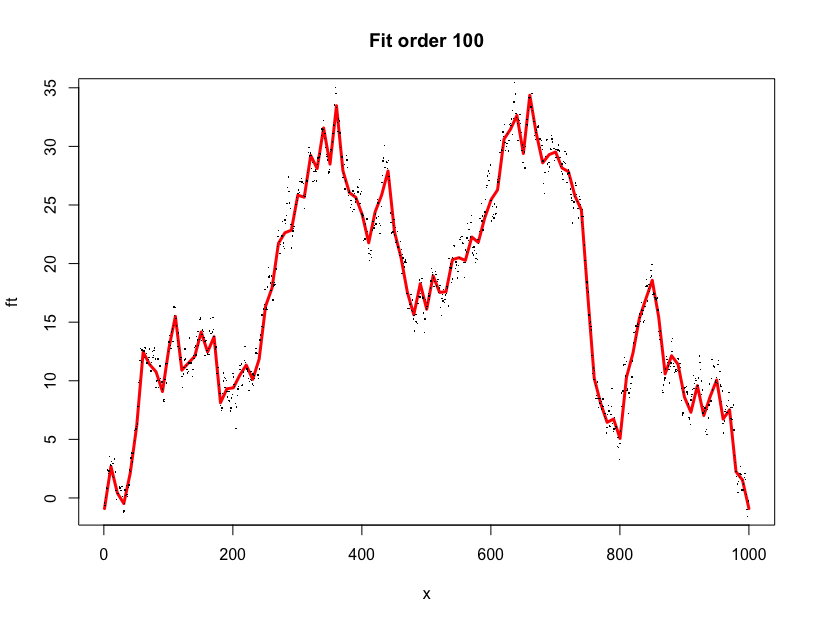

# ffit
Functions to fit data with Discrete Fourier Series.

## Installation
```r
install.packages('devtools', dep = T)
update.packages(ask = F)
devtools::install_github('filipezabala/ffit', force = T)
```

## Examples
```r
# Senoid
set.seed(123)
t0 <- 1:(5*24*60)
y <- ts(15 + 0.001*t0 + 10*sin(2*pi*t0/(length(t0)/5)) + rnorm(length(t0)), freq=length(t0)/5)
plot(y, type='l')
fit <- ffit(y)
plot(ft, lwd = 3, col = 'red', xlim = range(1:length(y)), main = paste0('Fit order ', fit$fit.order))
points(1:length(y), y, pch = '.')
```


```r
# Random data
n <- 1000
set.seed(4321)
y2 <- cumsum(rnorm(n))
(fit <- ffit(y2, fit.order = 100))
plot(ft, lwd = 3, col = 'red', xlim = range(1:n), main = paste0('Fit order ', fit$fit.order))
points(1:n, y2, pch = '.')
```

